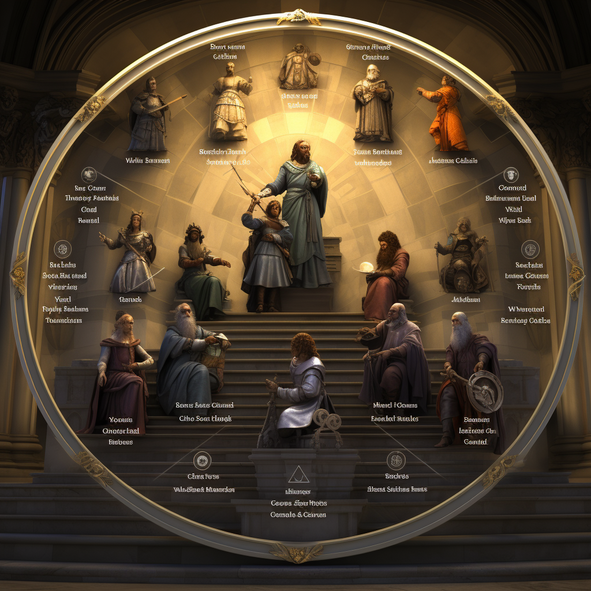
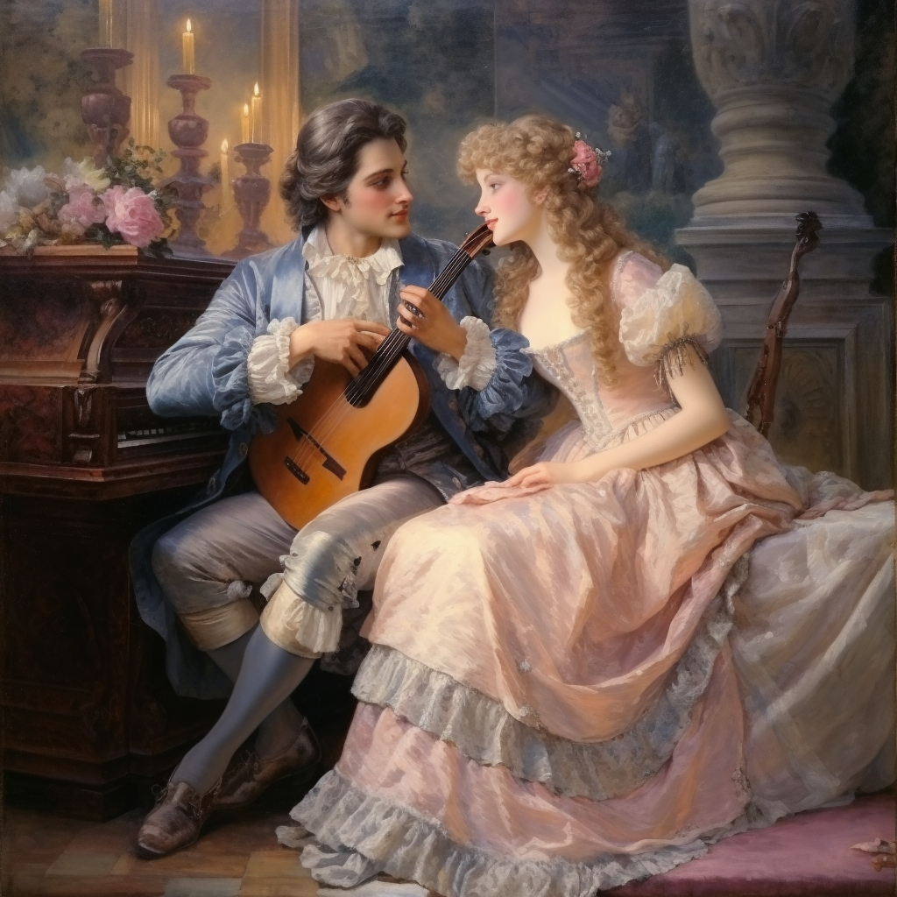
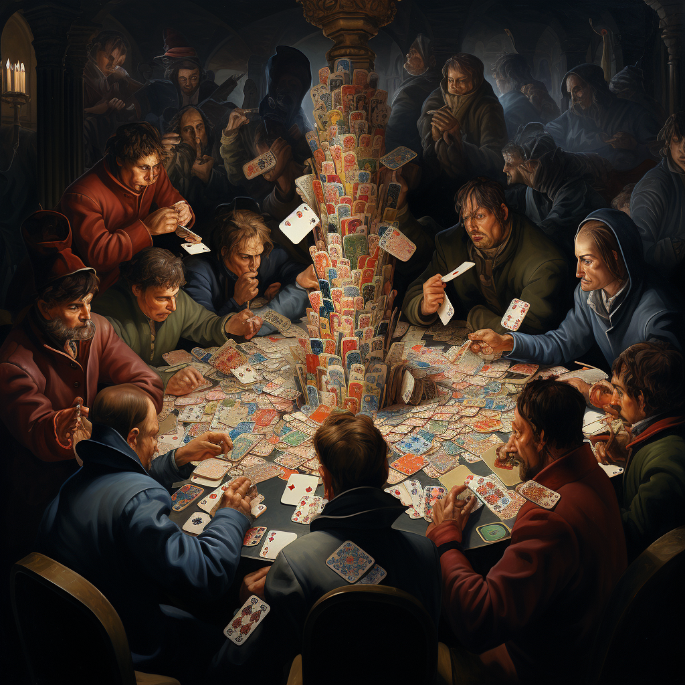
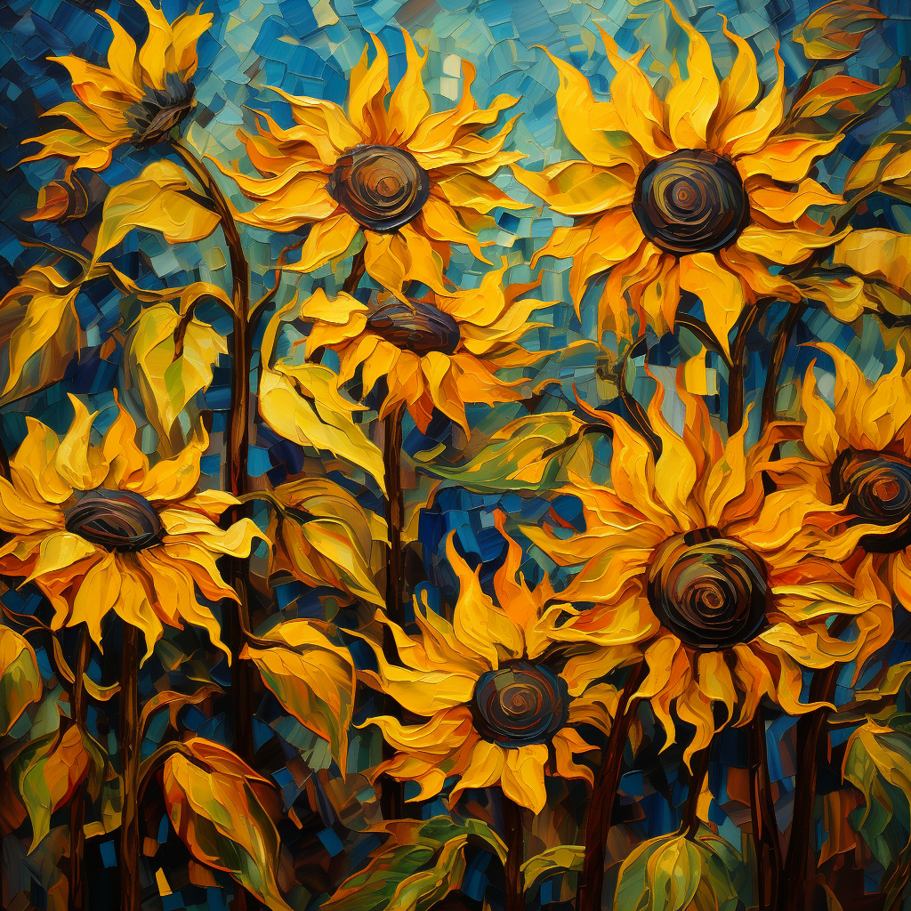
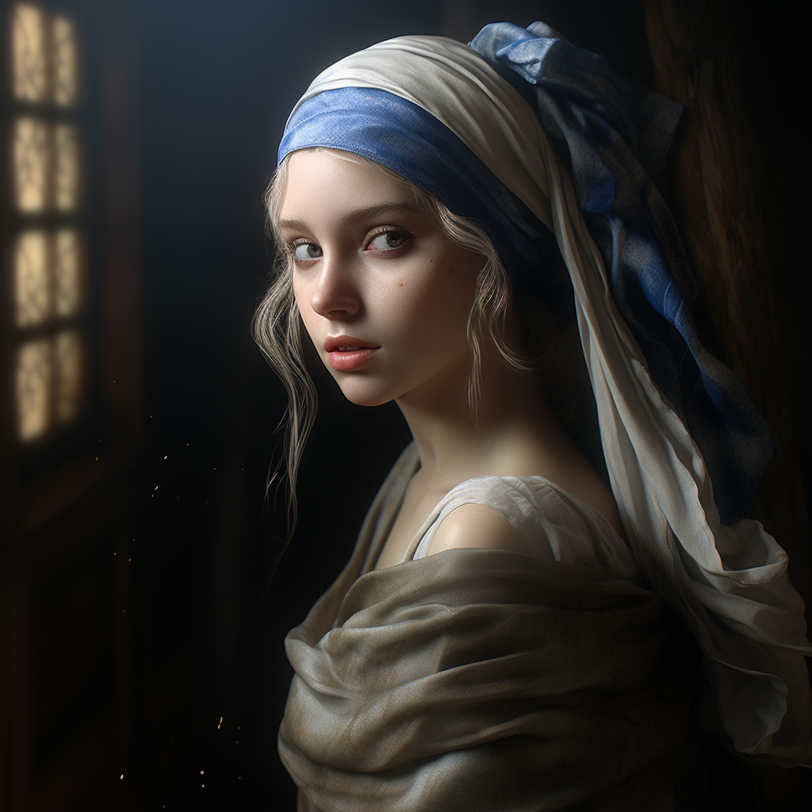
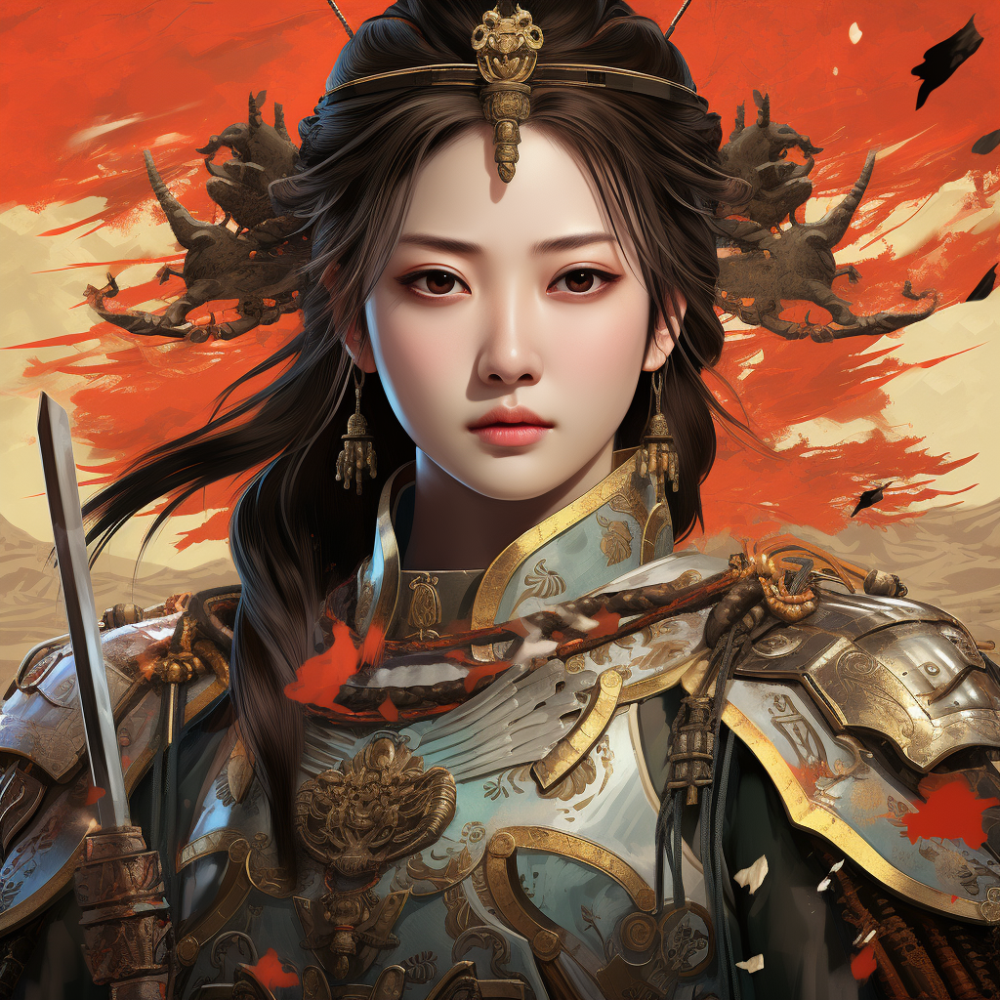
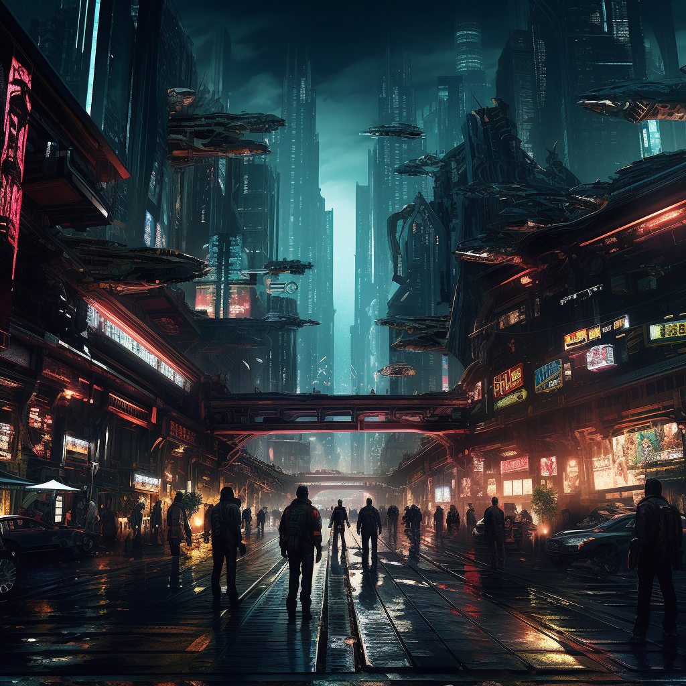
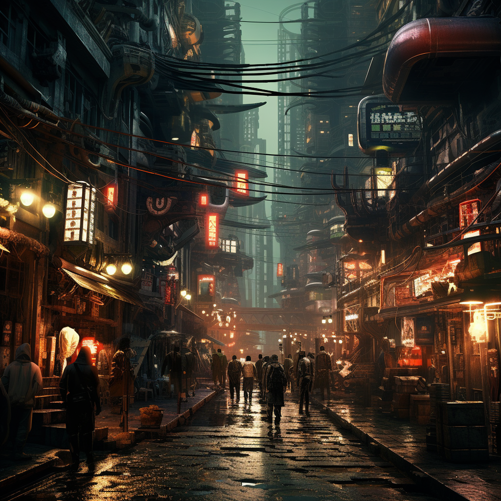
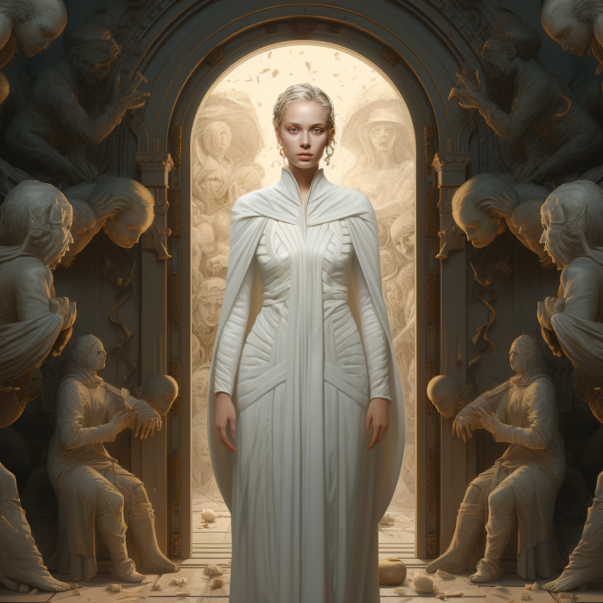
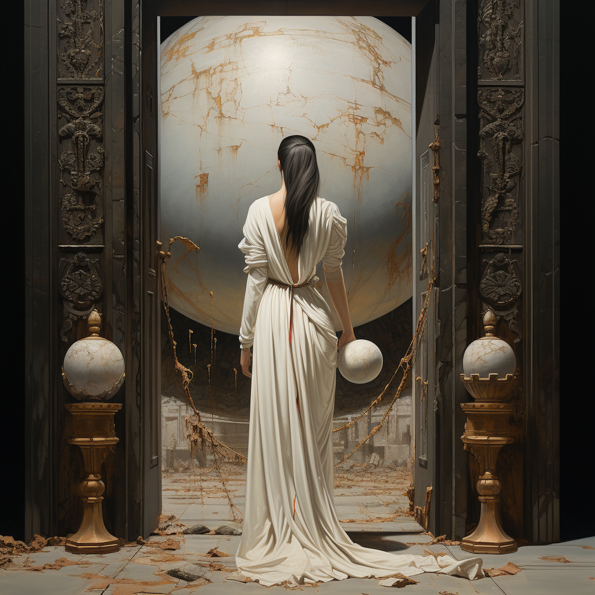

# 01. 艺术风格


## 古典现实主义


```prompt
astrological chart in 1908, in the style of classical figurative realism, Raphael Lacoste, Larray Elmore, Tanya Satseva, Neoclassical sculptures, celebrity image mashups, 500-1000 ce
```

```
1908年的星象图，古典写实主义风格，拉斐尔·拉科斯特，拉雷·埃尔莫尔，塔尼亚·萨特塞瓦，新古典主义雕塑，名人形象混搭，公元500-1000年
```





## 洛可可


```
oil painting of a couple plays music by the fireplace, rococo pastel tones, fine clothing details, elaborate costumes, Charles Robinson, charming gaze, depiction of aristocrats, rococo style
```


```
一对夫妇在壁炉旁演奏音乐的油画，洛可粉色调，精致的服装细节，复杂的服装，查尔斯·罗宾逊，迷人的目光，描绘贵族，洛可风格
```





## 印象派


```
Social Contract Theory, Impressionist style
```

```
社会契约理论，印象派风格
```


## 艺术家风格


```
a game among multple players, oil painting style
```




## 凡高风格


```
sunflowers, Van Gogh Style, Abstract Art
```





## 卡通风格


```
a girl with a pearl earring, cartoon
```


## 写实风格


```
a girl with a pearl earring, realism, +8K, full body, cinematic lighting, insanely detailed and intricate
```





## 极简风格


```
pure white minimalist world, minimalism
```


## 中国古典风格


```
Chinese classical style, poster of Mulan female general
```





## 赛博朋克风格


```
full of technology and darkness, city and chaos, resistance and adventure, Cyberpunk style
```







## 蒸汽朋克风格


```
train, Steampunk style, exquisite, detailed, HD
```


## 超现实主义


```
a woman in a white dress stands up in front of a door, in the style of hieratic visionary, Ferrania P30, majestic figures, scientific illustrations, Spacepunk, Neoclassical sculptures, blink-and-you-miss-it details
```

```
一位身穿白色连衣裙的女子站在一扇门前，采用神圣愿景风格，费拉尼亚·P30，威严的人物，科学插图，太空朋克，新古典主义雕塑，眨眼即逝的细节
```








