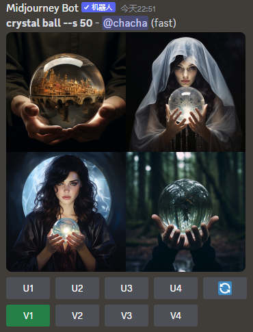
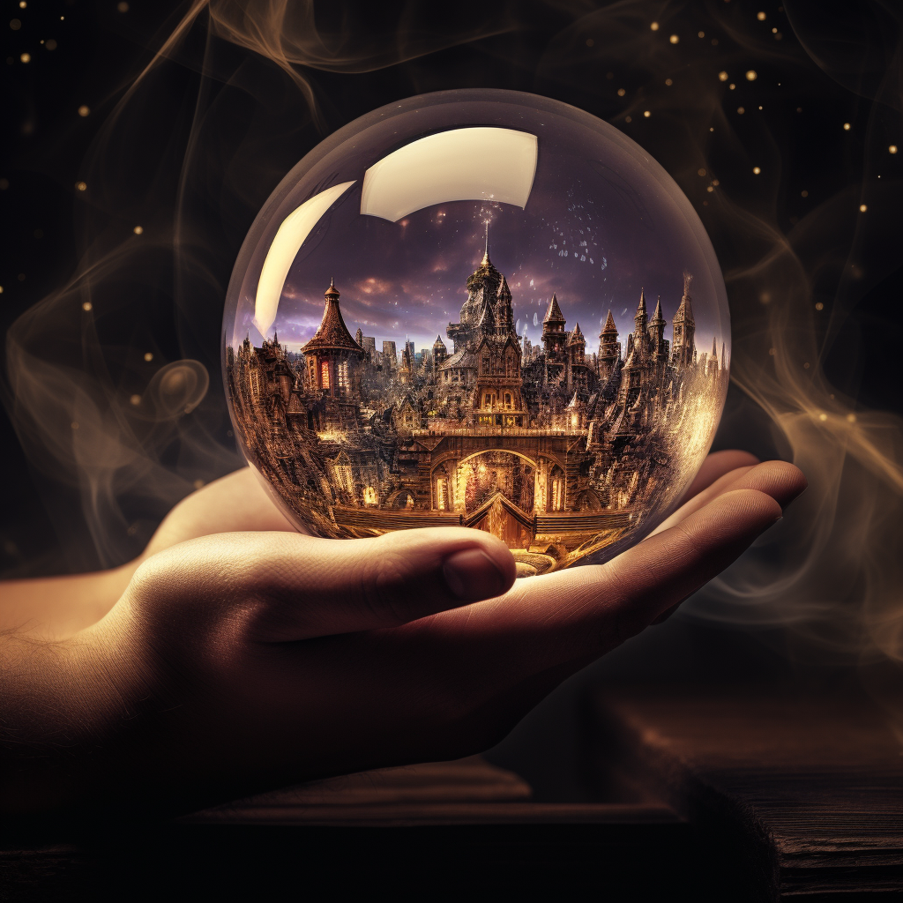

# 02. 基础入门


## 输入指令生成图片


```
/imagine prompt A group of children playing in the garden, high definition, detailed, warm light, --ar 9:5
```


示例，


```
A group of children playing in the garden, high definition, detailed, warm light, --ar 9:5
```


## U1~U4

U1~U4 可以放大相应的图片，放大后的图像分辨率会提升，默认比例下，会达到 1024x1024 的分辨率。


以 U2 为例，第2张图片被放大了。


（功能没有了）单击 "Make Variations" 这一选项，会弹出调整图片描述关键词的提示框，修改提示词后单击 "提交" 按钮可以根据当前图片生成相似风格的其他4张图片。


## V1~V4


V1~V4 可以衍生相应的图片，生成整体风格相似的4张衍生图片，


我们以V3为例，效果如下，


蓝色旋转按钮的功能是根据初始指令重新进行图片生成，得到与最初的4张图片风格不同但符合描述指令的4张新图片。


## Vary(Strong) 和 Vary(Subtle) 


Vary(Strong) 和 Vary(Subtle) 是重新绘制，


Vary(Subtle) 的效果，变化小，


Vary(Strong) 的效果，变化大，


## Vary(Region) 局部重绘


Vary(Region) 局部重绘，


使用 矩形工具("Rectangle Tool") 或 套索工具("Lasso Tool") 选择要重绘的区域，


示例，


示例效果，


## "Zoom Out 2x"，"Zoom Out 1.5x"，和 "Custom Zoom"


"Zoom Out 2x"，"Zoom Out 1.5x"，和 "Custom Zoom" 可以对图片进行缩放，


原始图片效果，


"Zoom Out 1.5x"效果，


"Zoom Out 2x" 效果，


## "Make Square"


"Make Square"，会在4个方向补绘图片，


## "Pan Left"，"Pan Right"，"Pan Up"，"Pan Down"


镜头转向左方("Pan Left")，镜头转向右方("Pan Right")，镜头转向上方("Pan Up")，镜头转向下方("Pan Down") 会在相应的方向补绘图片，


"Pan Left" 效果，


"Pan Right" 效果，


"Pan Up" 效果，


"Pan Down" 效果，


## 提供参考图


您可以在 Midjourney 中添加一张或多张参考图，


双击对话指令框左侧的 "+" 加号图标，在弹出的窗口中选择想要上传的图片，并点击"打开"按钮。

按 "Enter" 键将图片发送给 Midjourney。


单击发送的图片将其放大，单击复制图像链接。


将复制的链接粘贴到 prompt 输入框中，空一个，加上描述语，即可生成我们想要的图片。

示例，

```
The little boy is standing under the tree --ar 9:5
```


## 权重说明


关键词后面输入 --iw x，x 指的是数值，权重的默认值为 0.5，最大值则是 2，权重值越高，生成图像与参考图的相似度越高。


权重为 0.5 时示例效果，

```
https://s.mj.run/Vp78f2Mhgk4 clay style, light purple jacket, purple eyes, light purple hair, cute, octane rendering, high definition, details --iw 0.5
```


权重为 1 时示例效果，

```
https://s.mj.run/Vp78f2Mhgk4 clay style, light purple jacket, purple eyes, light purple hair, cute, octane rendering, high definition, details --iw 1
```


权重为 2 时示例效果，

```
https://s.mj.run/Vp78f2Mhgk4 clay style, light purple jacket, purple eyes, light purple hair, cute, octane rendering, high definition, details --iw 2
```


## 一键换脸


添加 insightface bot 小机器人，

```
https://discord.com/api/oauth2/authorize?client_id=1090660574196674713&permisssions=274877945856&scope=bot
```


输入 `/saveid`，这一模块的功能是按名称和图像保存身份特征。随后，在 idname 中输入名称就可以上传了。


上传 ID 后，选择 `/swapid` 模式。输入刚刚设置的 ID 名称，并上传想要替换的主题照片。

按回车键，换脸成功。


## prompt 的灵感武器


OpenArt 网站上有相当全的 prompt 及 AI 作品，可以把它当作一个很大的关键词库，复制、参考其中的关键词。

[https://openart.ai/discovery](https://openart.ai/discovery)


## 设置


在对话框中输入 `/settings`，按回车键，即可进入设置界面。


风格：V1、V2、V3、V4、V5、V5.2 版本偏向于写实风，数字越大的版本，生成的图片越逼真；Niji 模式的 V4、V5 版本这属于二次元风格。

图片质量：分为低、基础、高三个等级。质量越低，渲染时间越短。

风格化：风格化越低，与 prompt 描述越接近；风格化越高，生成的图像越天马行空。

输出模式：有分公开、密码、混合、快速、慢速 5 个选项。设置输出模式，需要在图像生成之前进行。


用户也可以直接使用 `--q <0.25, 0.5, 1, or 2>` `--v 1-5` `--s 0-750` 分别代表图片质量、版本和风格化。


## 混合模式


进入 `settings`，选择开启 `Remix model`。


输入示例，`crystal ball`，




单击 V1~V4，系统会弹出一个 "Remix Prompt" 对话框。在原基础上添加 "magic" 和 `--q 2`。


从生成的图片中可以看出，以上操作在原图的基础上添加了魔法效果。





在原有的基础上将 "crystal ball" 修改为 "football"，如果不想原图中的 "手" 出现，可以添加一个 `--no hand`,


```
football --s 50 --no hand --no backgroud
```


## 以图生图


想要以图生图，可以使用 `/blend` 指令，单击上传图片按钮，最多可以添加 5 张图片。


## 以图生文


输入 `/describe` 后上传所保存的图片，按回车键发送。AI 会自动 4 个与该图片相关的 prompt。

选择图像下方任意一个序号按钮，系统会弹出 "Imagine This!" 提醒对话框，可以选择修改对话框中的描述，也可以选择直接单击 "Submit" 按钮，提交后即可生成相似的图片。