# 03. 通用知识


## 灯光的聚集与离散


"灯光聚焦" 示例，

```
museum porcelain, aggregative lighting
```


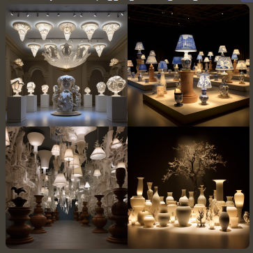


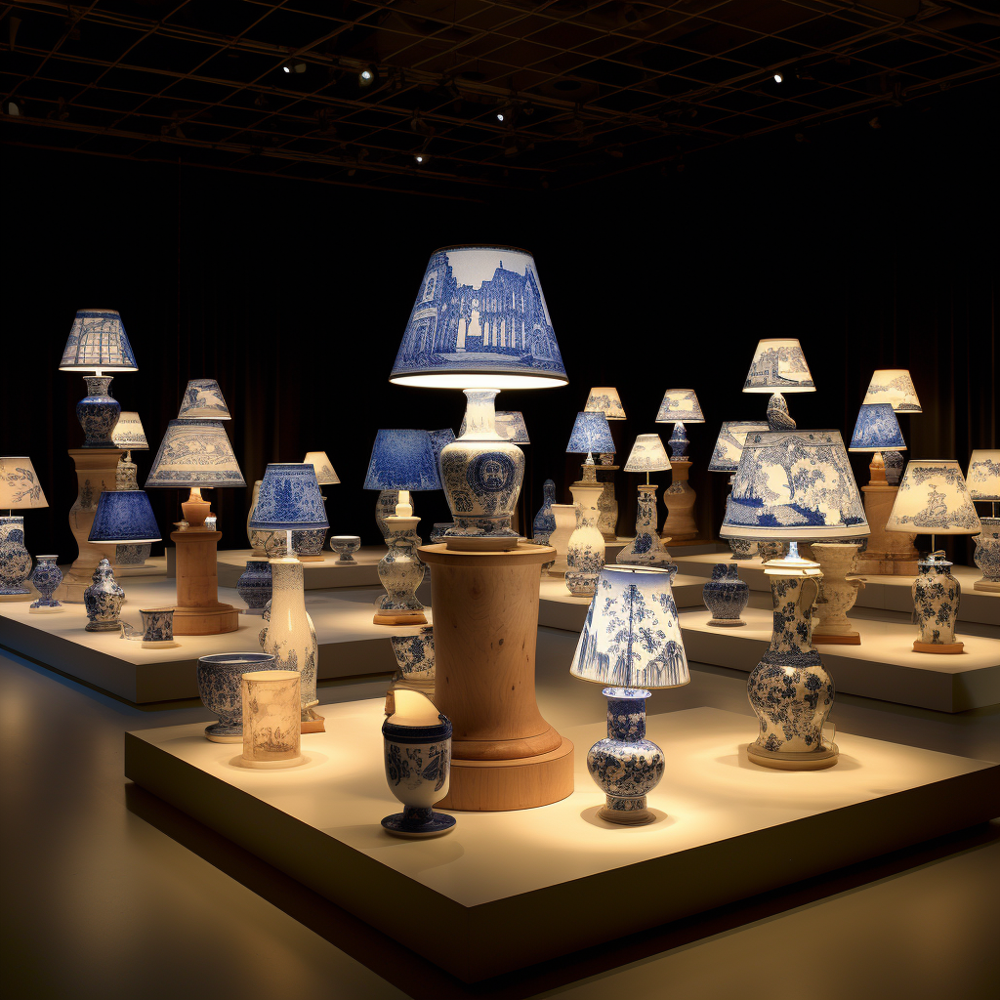


"灯光离散" 示例，

```
street lights, discrete lighting
```

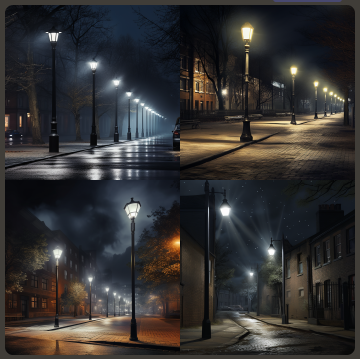


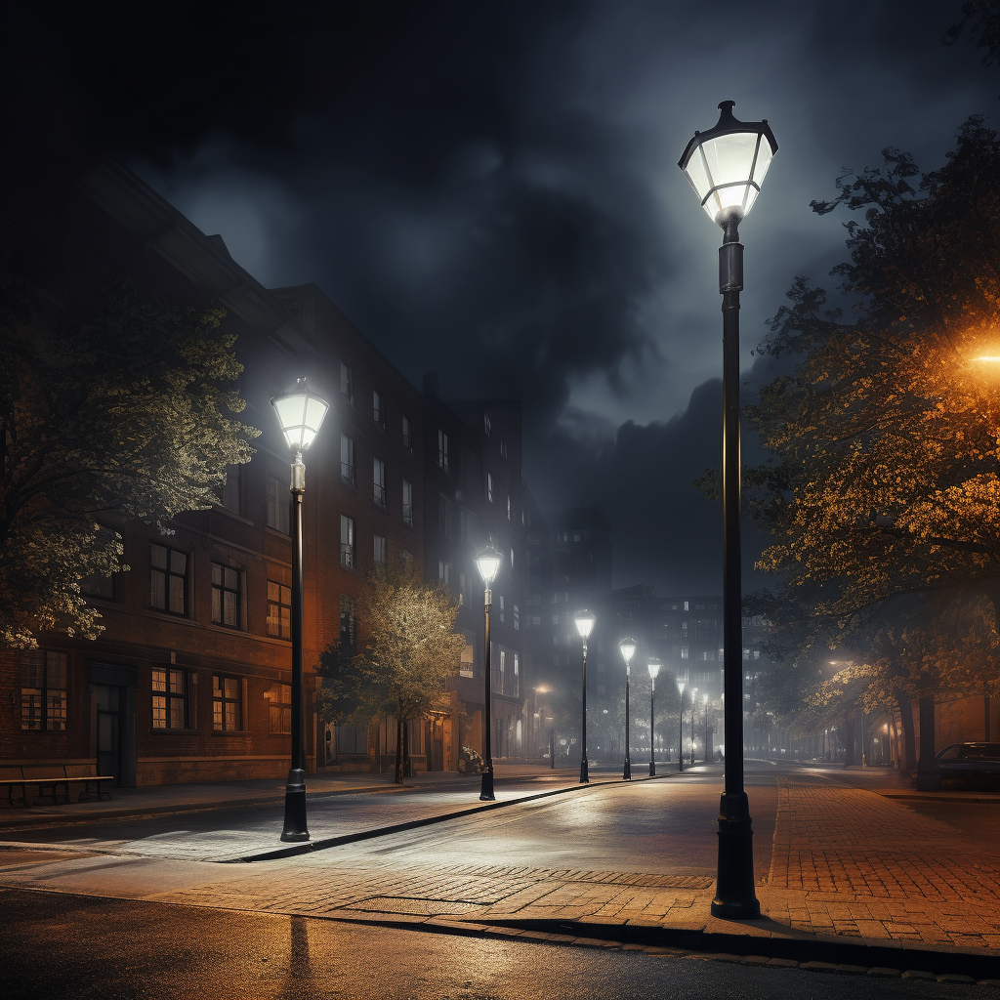

## 一些实用的灯光关键词


- 电影光：Cinematic light
- 立体光：Volumetric light
- 影棚光：Studio light
- 自然光：Natural light
- 顶光（蝴蝶光）：Top light
- 测光（伦勃朗光）：Raking light
- 边缘光：Edge light
- 逆光：Back light
- 强光：Hard light
- 柔光：Soft light
- 晨光：Morning light
- 日光：Sun light
- 荧光灯光：Fluorescent light
- 赛博朋克光：Cyberpunk light
- 正面光：Front light
- 侧面光：Side light
- 黄金光（傍晚临界时间）：Golden hour light
- 冷光：Cold light
- 暖光：Warm light
- 戏剧性的光：Dramatic light
- 色光：Color light
- 霓虹灯光：Neon light


Cinematic light 示例，

```
potrait of beautiful girl, Chinese, black backgroud, Cinematic light, --ar 9:5 --q 2 --seed 96836389
```

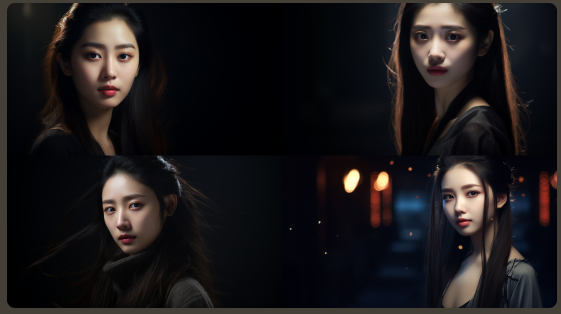


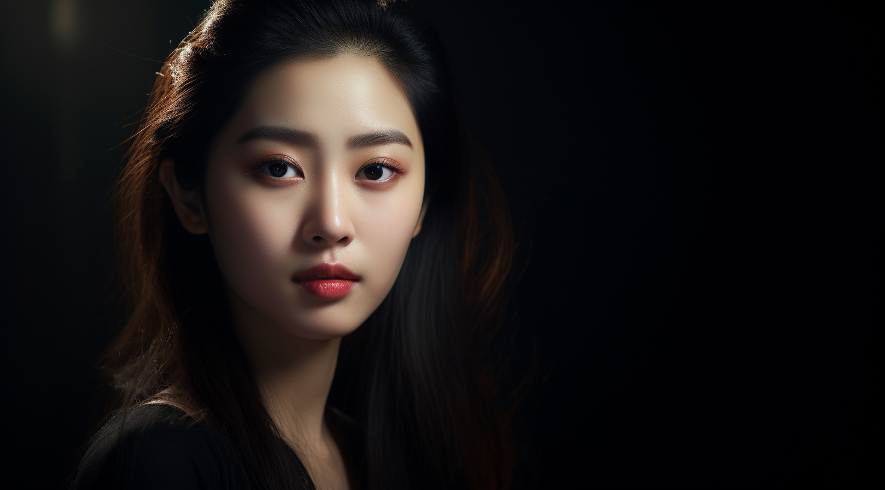

Volumetric light 示例，

```
potrait of beautiful girl, Chinese, black backgroud, Volumetric light, --ar 9:5 --q 2 --seed 96836389
```


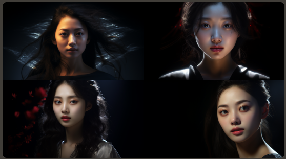

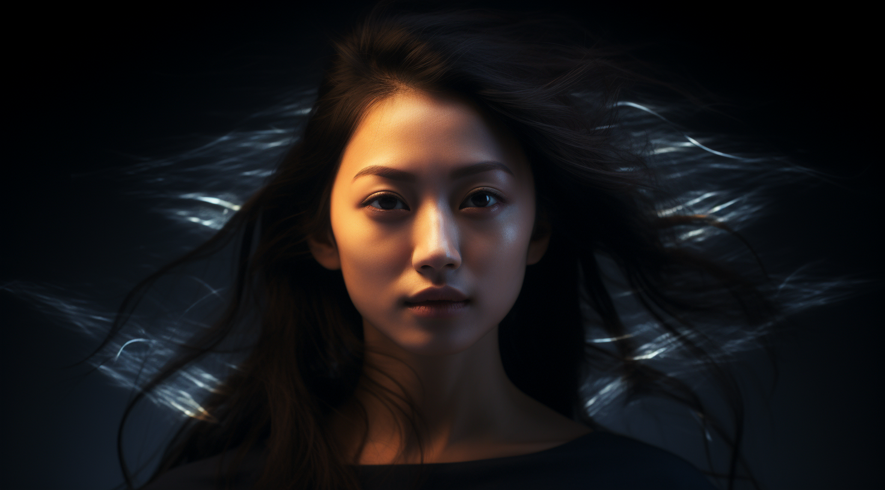


Studio light 示例，

```
potrait of beautiful girl, Chinese, black backgroud, Studio light, --ar 9:5 --q 2 --seed 96836389
```


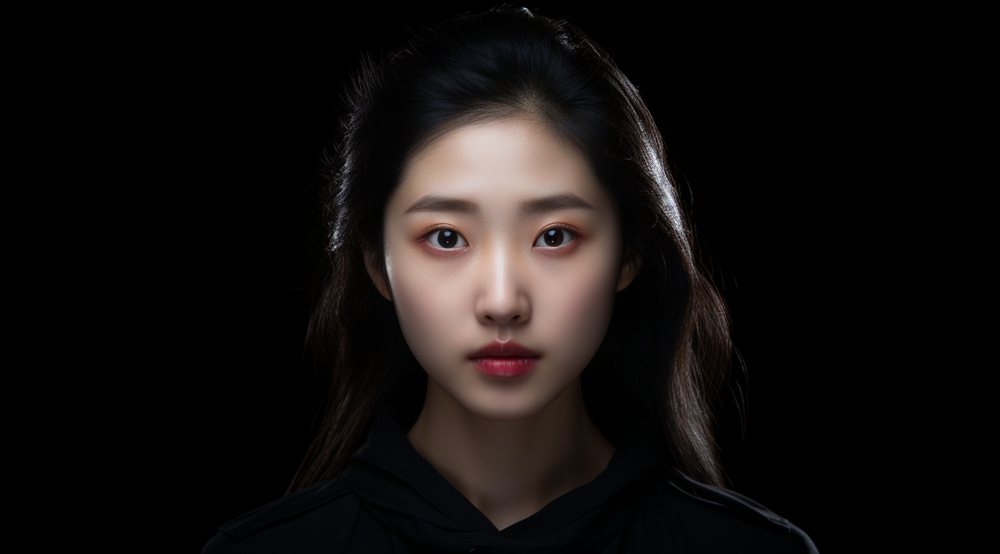


Natrual light 示例，

```
potrait of beautiful girl, Chinese, black backgroud, Natrual light, --ar 9:5 --q 2 --seed 96836389
```


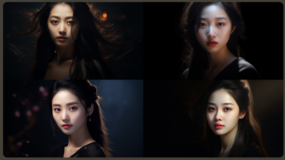


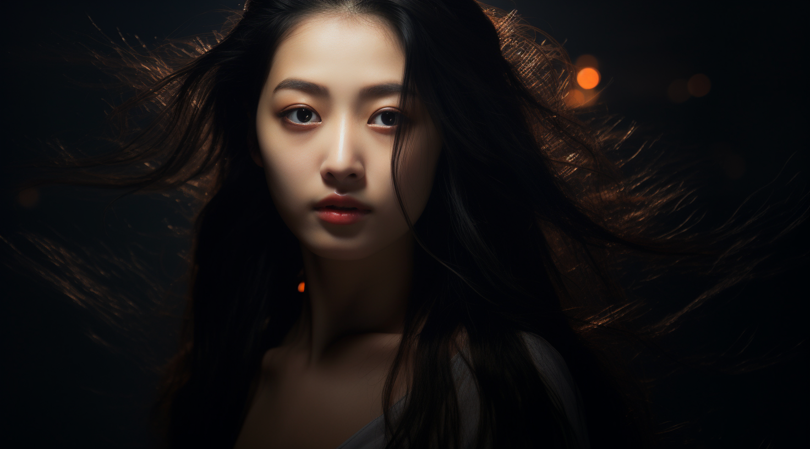

Golden hour light 示例，

```
potrait of beautiful girl, Chinese, black backgroud, Golden hour light, --ar 9:5 --q 2 --seed 96836389
```


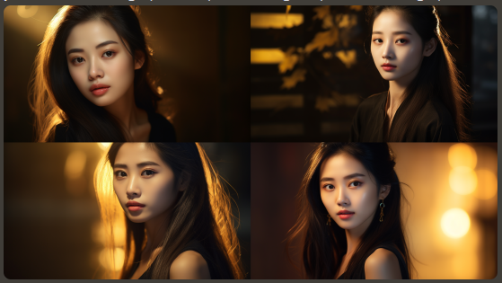


Sun light 示例，

```
potrait of beautiful girl, Chinese, black backgroud, Sun light, --ar 9:5 --q 2 --seed 96836389
```


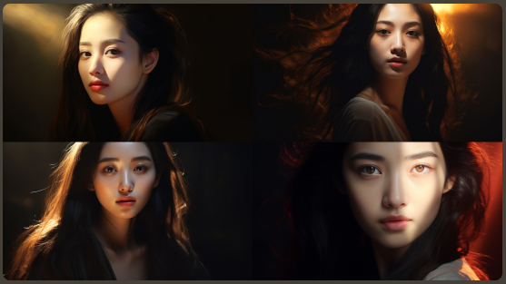


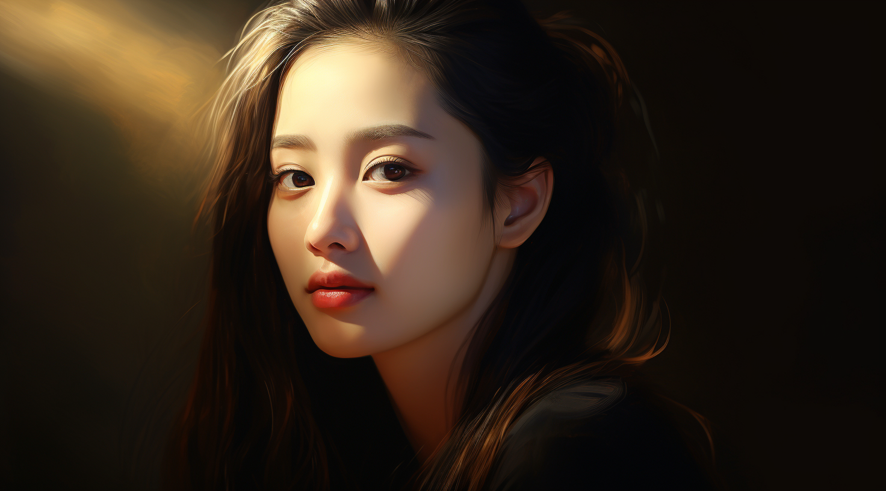

fluorescent light 示例，

```
potrait of beautiful girl, Chinese, black backgroud, fluorescent light, --ar 9:5 --q 2 --seed 96836389
```


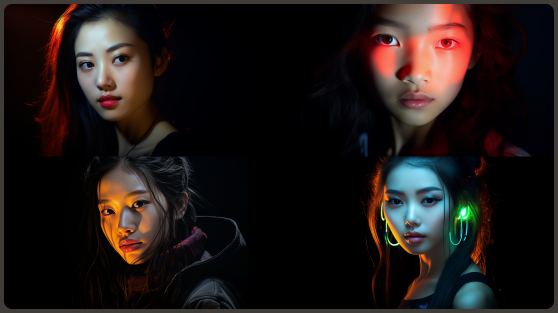

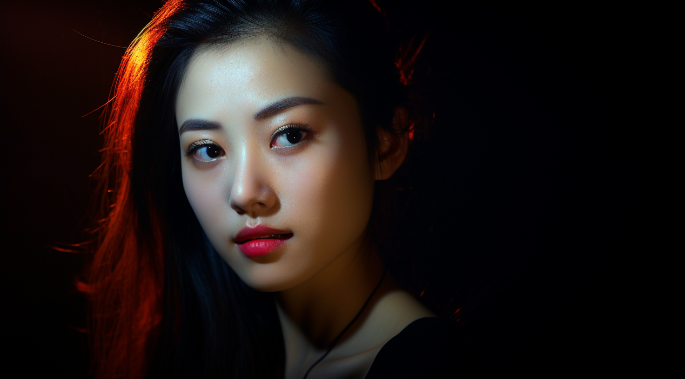


## 镜头语言


要在 AI 绘画作品中体现摄影效果，镜头语言是十分重要的。镜头语言有两个重要参数，即焦距和光圈。

焦距是以毫米（mm）为单位，如果想呈现更广的画面，即远景，可以调整焦距。对同一款相机来说，焦距数值越大，视角越小，可以将远处的景物放得较大；反之，焦距数值越小，视角越广。

光圈主要影响画面虚实，它的书写形式一般为f/X，如f/2.8意为光圈为2.8，数字越大光圈越小，比如 f/1.4>f/2.8/f/4。


示例，

```
plum bloosoms on a snowy day --seed 1245
```

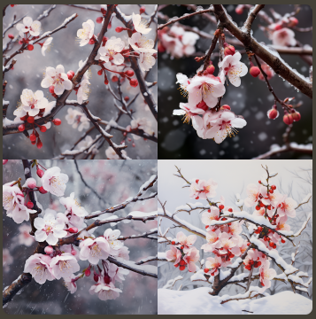


35mm, f/1.8 示例，

```
plum bloosoms on a snowy day, 35mm lens, f/1.8, DSLR --seed 1245
```

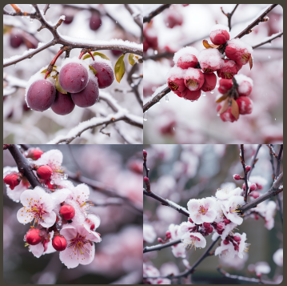


50mm, f/1.8 示例，

```
plum bloosoms on a snowy day, 50mm lens, f/1.8, DSLR --seed 1245
```

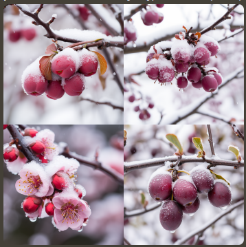


35mm, f/1.4 示例，

```
plum bloosoms on a snowy day, 35mm lens, f/1.4, DSLR --seed 1245
```

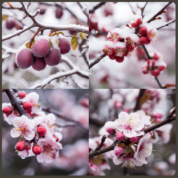

35mm, f/4 示例，

```
plum bloosoms on a snowy day, 35mm lens, f/4, DSLR --seed 1245
```

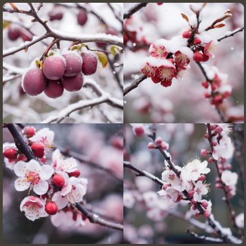


## 镜头构图关键词


- 超广角：ultrawide shot，超广角比广角拥有更宽阔的视野。

  示例，

  ```
  a 14-year-old boy, forest, bright eyes, Hayao Miyazaki style, Spirited Away animated film, Japan anime style, ultrawide shot
  ```

  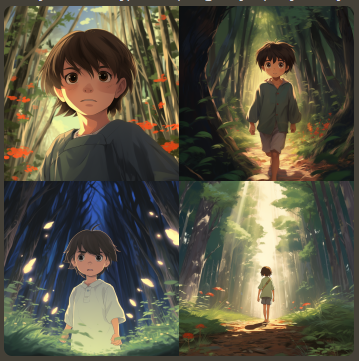

- 鸟瞰：aerial view，从高处往下看，如同鸟类俯视视角中的景象。它可以用于生成飞机或无人机拍摄的航拍视图，也可以用于生成建筑物、城市或自然景观的全貌视图。

  示例，

  ```
  a 14-year-old boy, forest, bright eyes, Hayao Miyazaki style, Spirited Away animated film, Japan anime style, aerial view
  ```

  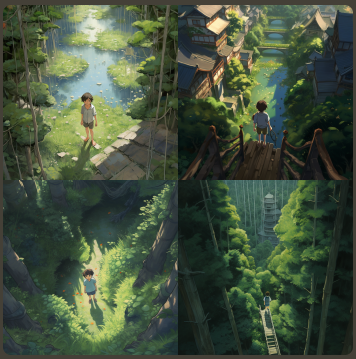

- 景深：depth of field，刻画主题，虚化背景，通过加强对比使得主体更清晰。

  示例，

  ```
  a 14-year-old boy, forest, bright eyes, Hayao Miyazaki style, Spirited Away animated film, Japan anime style, depth of field
  ```

  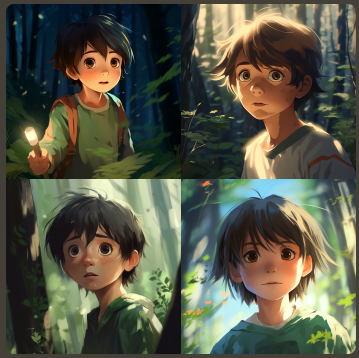

- 特写：close-up，针对某一特定局部，生成定格图片。

  示例，

  ```
  a 14-year-old boy, forest, bright eyes, Hayao Miyazaki style, Spirited Away animated film, Japan anime style, close-up
  ```

  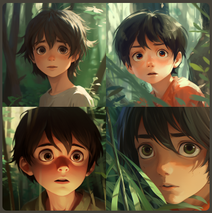

- 中特写：medium close-up，比特写更大，人物面部几乎占满画面。

  示例，

  ```
  a 14-year-old boy, forest, bright eyes, Hayao Miyazaki style, Spirited Away animated film, Japan anime style, medium close-up
  ```

  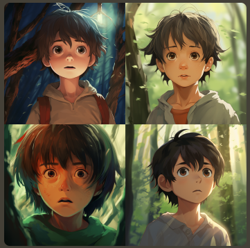

- 大特写：detail shot，比中特写更大，经常是对半张脸的细节呈现。比起中特写，大特写中人物的轮廓和皮肤更清晰、细致。

  示例，

  ```
  a 14-year-old boy, forest, bright eyes, Hayao Miyazaki style, Spirited Away animated film, Japan anime style, detail shot
  ```

  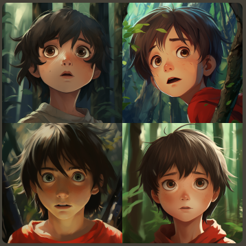

- 中部以上：above the middle，通常呈现人物肩膀以上的画面，适合用于生成头像或一寸照片。

  示例，

  ```
  a 14-year-old boy, forest, bright eyes, Hayao Miyazaki style, Spirited Away animated film, Japan anime style, above the middle
  ```

  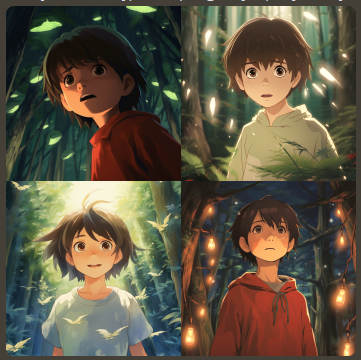

- 腰部以上：waist shot，通常呈现人物腰部以上的画面，适合用于生成本身照。

  示例，

  ```
  a 14-year-old boy, forest, bright eyes, Hayao Miyazaki style, Spirited Away animated film, Japan anime style, waist shot
  ```

  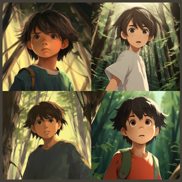

- 膝部以上：knee shot，通常呈现站立的人物或人物膝盖以上的画面，适合用于生成插画或封面。

  示例，

  ```
  a 14-year-old boy, forest, bright eyes, Hayao Miyazaki style, Spirited Away animated film, Japan anime style, knee shot
  ```

  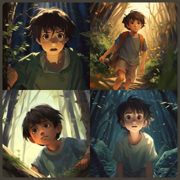

- 全身：full length shot，通常呈现人物全身的画面。

  示例，

  ```
  a 14-year-old boy, forest, bright eyes, Hayao Miyazaki style, Spirited Away animated film, Japan anime style, full length shot
  ```

  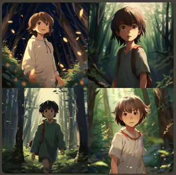

- 近景：close shot，生成的图片较为稳定，但不如特写画面细致。

  示例，

  ```
  a 14-year-old boy, forest, bright eyes, Hayao Miyazaki style, Spirited Away animated film, Japan anime style, close shot
  ```

  

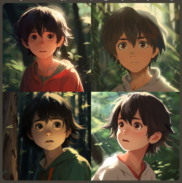

## 相机关键词


Canon 5D, FUJIFILM XT100, Sony Alpha (佳能 5D 相机，富士通 XT00 相机，索尼 Alpha 相机)


示例，

```
a 14-year-old boy, forest, bright eyes, Hayao Miyazaki style, Spirited Away animated film, Japan anime style, close-up, Canon 5D, FUJIFILM XT100, Sony Alpha
```

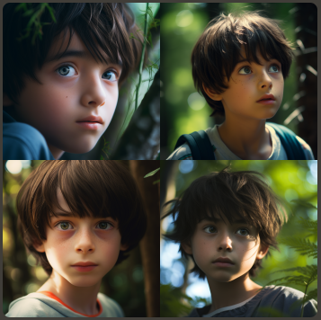


## 构图技巧之摄影风格


在 Midjourney 中，想要让生成的图片更像照片，我们要学会使用以下指令公式，

```
摄影风格 + 目标主体 + 打光 + 相机类型 + 角度 + 辅助词 + 8K/4K
```


摄影风格如下，

- 街头摄影风格：Street Photography，抓拍公共场所人物和事件的真实瞬间。

  ```
  street photography, a girl in the street, FUJIFILM X100V, eye level, soft, wide, immersive, 8K
  ```

  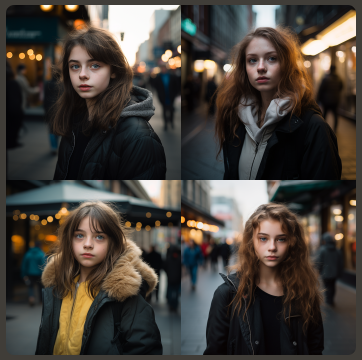

- 人像摄影：Portrait，捕捉个人或人群的特点。

  ```
  portrait, artistic wedding photo of a couple getting married, Canon EOS 5D Mark iV, eye level, soft, rembrandt, close-up, 8k
  ```

  

- 纪实摄影：Documentary Photography，用于记录历史或文化事件及真实环境。

  ```
  documentary photography, ancient buildings, Nikon Z 6II, eye level, natural, wide, immersive
  ```

  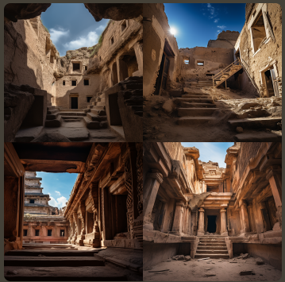

- 夜色摄影：Night Photography，用于拍摄夜晚城市风光、景观等。

- 音乐会摄影：Concert Photography，用于拍摄音乐会现场表演的镜像。

- 艺术馆摄影：Fine Art Photography，用于表达艺术家视觉的图像，通常具有概念性元素或抽象元素。

- 水下摄影：Underwater Photography，用于拍摄水生生物、水上运动或水下景观。

- 全景摄影：Panoramic Photography，用于捕捉超出单帧视野范围的宽幅影像。

- 抽象摄影：Abstract Photography，用于捕捉聚焦于颜色、形状和质感的影响，通常没有明确的注意力聚焦点。


## 拍摄角度


- 正面：Front，
- 背面：Back，
- 侧面：Side，


## 拍摄位置


- 低角度拍摄视图：low angle view

  ```
  an elegant girl, low angle view
  ```

  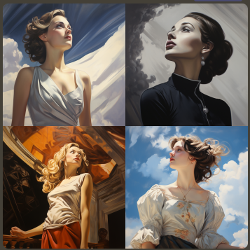

- 高角度拍摄视图：high angle view

  ```
  an elegant girl, high angle view
  ```

  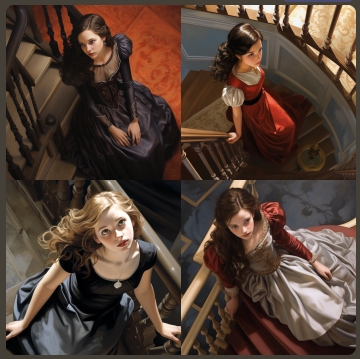

- 地面视图：ground level view

  ```
  an elegant girl, ground level view
  ```

  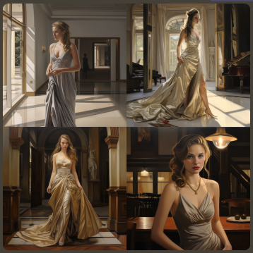

- 俯视图：overhead view

  ```
  an elegant girl, overhead view
  ```

  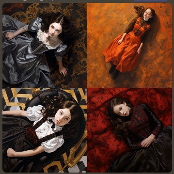

- 眼睛平视视图：eye level view

  ```
  an elegant girl, eye level view
  ```

  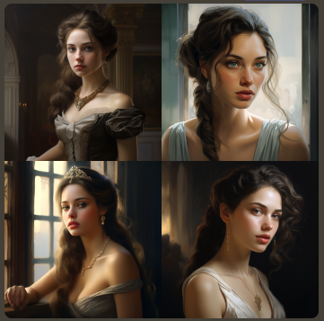

- 肩膀平视视图：shoulder level view

  ```
  an elegant girl, shoulder level view
  ```

  

- 臂部水平视图：hip level view

  ```
  an elegant girl, hip level view
  ```

  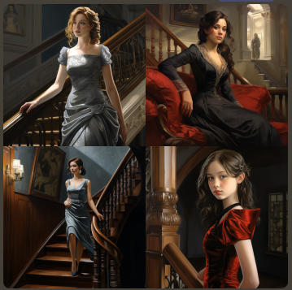

- 膝盖水平视图：knee level view

  ```
  an elegant girl, knee level view
  ```

  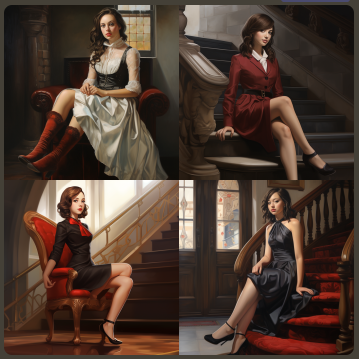