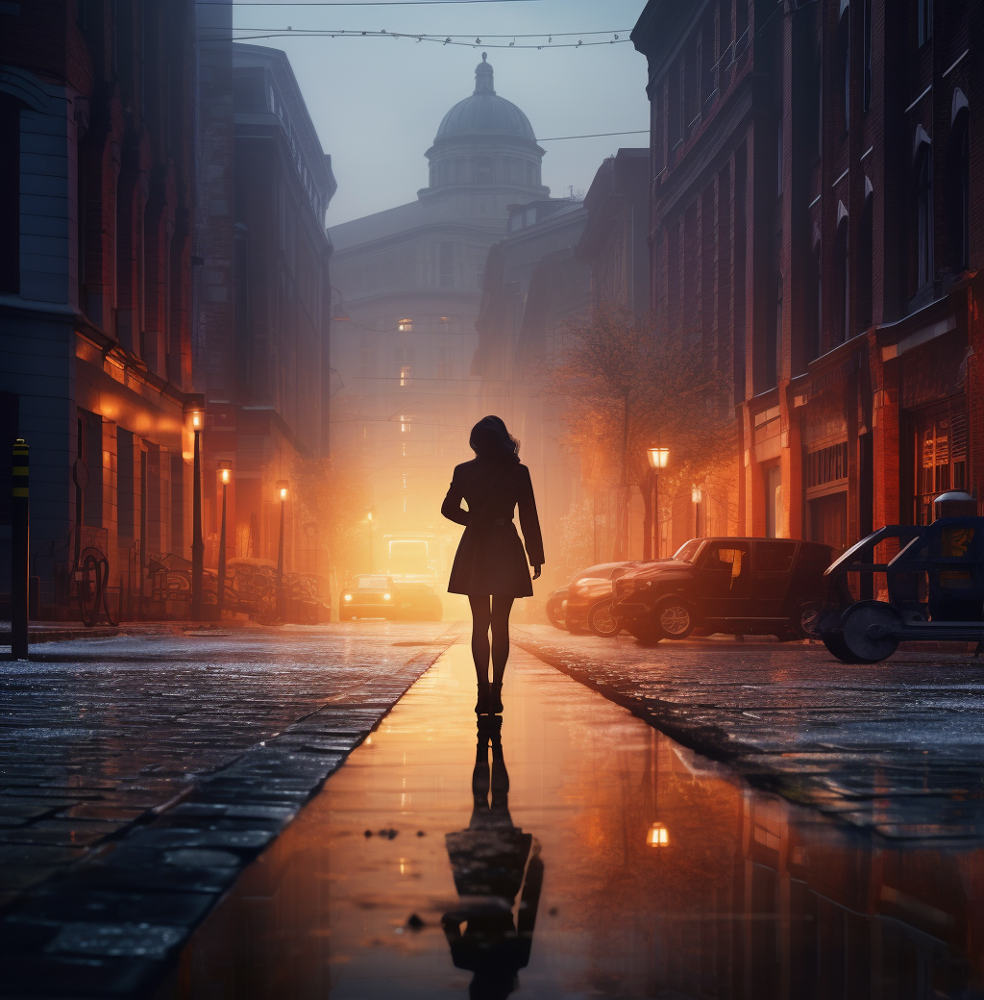

# 03. 通用知识


## 灯光的聚集与离散


"灯光聚焦" 示例，

```
museum porcelain, aggregative lighting
```


"灯光离散" 示例，

```
street lights, discrete lighting
```


## 一些实用的灯光关键词


- 电影光：Cinematic light
- 立体光：Volumetric light
- 影棚光：Studio light
- 自然光：Natural light
- 顶光（蝴蝶光）：Top light
- 测光（伦勃朗光）：Raking light
- 边缘光：Edge light
- 逆光：Back light
- 强光：Hard light
- 柔光：Soft light
- 晨光：Morning light
- 日光：Sun light
- 荧光灯光：Fluorescent light
- 赛博朋克光：Cyberpunk light
- 正面光：Front light
- 侧面光：Side light
- 黄金光（傍晚临界时间）：Golden hour light
- 冷光：Cold light
- 暖光：Warm light
- 戏剧性的光：Dramatic light
- 色光：Color light
- 霓虹灯光：Neon light


Cinematic light 示例，

```
potrait of beautiful girl, Chinese, black backgroud, Cinematic light, --ar 9:5 --q 2 --seed 96836389
```


Volumetric light 示例，

```
potrait of beautiful girl, Chinese, black backgroud, Volumetric light, --ar 9:5 --q 2 --seed 96836389
```


Studio light 示例，

```
potrait of beautiful girl, Chinese, black backgroud, Studio light, --ar 9:5 --q 2 --seed 96836389
```


Natrual light 示例，

```
potrait of beautiful girl, Chinese, black backgroud, Natrual light, --ar 9:5 --q 2 --seed 96836389
```


Golden hour light 示例，

```
potrait of beautiful girl, Chinese, black backgroud, Golden hour light, --ar 9:5 --q 2 --seed 96836389
```


Sun light 示例，

```
potrait of beautiful girl, Chinese, black backgroud, Sun light, --ar 9:5 --q 2 --seed 96836389
```


fluorescent light 示例，

```
potrait of beautiful girl, Chinese, black backgroud, fluorescent light, --ar 9:5 --q 2 --seed 96836389
```


## 镜头语言


要在 AI 绘画作品中体现摄影效果，镜头语言是十分重要的。镜头语言有两个重要参数，即焦距和光圈。

焦距是以毫米（mm）为单位，如果想呈现更广的画面，即远景，可以调整焦距。对同一款相机来说，焦距数值越大，视角越小，可以将远处的景物放得较大；反之，焦距数值越小，视角越广。

光圈主要影响画面虚实，它的书写形式一般为f/X，如f/2.8意为光圈为2.8，数字越大光圈越小，比如 f/1.4>f/2.8/f/4。


示例，

```
plum bloosoms on a snowy day --seed 1245
```


35mm, f/1.8 示例，

```
plum bloosoms on a snowy day, 35mm lens, f/1.8, DSLR --seed 1245
```


50mm, f/1.8 示例，

```
plum bloosoms on a snowy day, 50mm lens, f/1.8, DSLR --seed 1245
```


35mm, f/1.4 示例，

```
plum bloosoms on a snowy day, 35mm lens, f/1.4, DSLR --seed 1245
```


35mm, f/4 示例，

```
plum bloosoms on a snowy day, 35mm lens, f/4, DSLR --seed 1245
```


## 镜头构图关键词


- 超广角：ultrawide shot，超广角比广角拥有更宽阔的视野。

  示例，

  ```
  a 14-year-old boy, forest, bright eyes, Hayao Miyazaki style, Spirited Away animated film, Japan anime style, ultrawide shot
  ```

  

- 鸟瞰：aerial view，从高处往下看，如同鸟类俯视视角中的景象。它可以用于生成飞机或无人机拍摄的航拍视图，也可以用于生成建筑物、城市或自然景观的全貌视图。

  示例，

  ```
  a 14-year-old boy, forest, bright eyes, Hayao Miyazaki style, Spirited Away animated film, Japan anime style, aerial view
  ```

  

- 景深：depth of field，刻画主题，虚化背景，通过加强对比使得主体更清晰。

  示例，

  ```
  a 14-year-old boy, forest, bright eyes, Hayao Miyazaki style, Spirited Away animated film, Japan anime style, depth of field
  ```

  

- 特写：close-up，针对某一特定局部，生成定格图片。

  示例，

  ```
  a 14-year-old boy, forest, bright eyes, Hayao Miyazaki style, Spirited Away animated film, Japan anime style, close-up
  ```

  

- 中特写：medium close-up，比特写更大，人物面部几乎占满画面。

  示例，

  ```
  a 14-year-old boy, forest, bright eyes, Hayao Miyazaki style, Spirited Away animated film, Japan anime style, medium close-up
  ```

  

- 大特写：detail shot，比中特写更大，经常是对半张脸的细节呈现。比起中特写，大特写中人物的轮廓和皮肤更清晰、细致。

  示例，

  ```
  a 14-year-old boy, forest, bright eyes, Hayao Miyazaki style, Spirited Away animated film, Japan anime style, detail shot
  ```

  

- 中部以上：above the middle，通常呈现人物肩膀以上的画面，适合用于生成头像或一寸照片。

  示例，

  ```
  a 14-year-old boy, forest, bright eyes, Hayao Miyazaki style, Spirited Away animated film, Japan anime style, above the middle
  ```

  

- 腰部以上：waist shot，通常呈现人物腰部以上的画面，适合用于生成本身照。

  示例，

  ```
  a 14-year-old boy, forest, bright eyes, Hayao Miyazaki style, Spirited Away animated film, Japan anime style, waist shot
  ```

  

- 膝部以上：knee shot，通常呈现站立的人物或人物膝盖以上的画面，适合用于生成插画或封面。

  示例，

  ```
  a 14-year-old boy, forest, bright eyes, Hayao Miyazaki style, Spirited Away animated film, Japan anime style, knee shot
  ```

  

- 全身：full length shot，通常呈现人物全身的画面。

  示例，

  ```
  a 14-year-old boy, forest, bright eyes, Hayao Miyazaki style, Spirited Away animated film, Japan anime style, full length shot
  ```

  

- 近景：close shot，生成的图片较为稳定，但不如特写画面细致。

  示例，

  ```
  a 14-year-old boy, forest, bright eyes, Hayao Miyazaki style, Spirited Away animated film, Japan anime style, close shot
  ```

  


## 相机关键词


Canon 5D, FUJIFILM XT100, Sony Alpha (佳能 5D 相机，富士通 XT00 相机，索尼 Alpha 相机)


示例，

```
a 14-year-old boy, forest, bright eyes, Hayao Miyazaki style, Spirited Away animated film, Japan anime style, close-up, Canon 5D, FUJIFILM XT100, Sony Alpha
```


## 构图技巧之摄影风格


在 Midjourney 中，想要让生成的图片更像照片，我们要学会使用以下指令公式，

```
摄影风格 + 目标主体 + 打光 + 相机类型 + 角度 + 辅助词 + 8K/4K
```


摄影风格如下，

- 街头摄影风格：Street Photography，抓拍公共场所人物和事件的真实瞬间。

  ```
  street photography, a girl in the street, FUJIFILM X100V, eye level, soft, wide, immersive, 8K
  ```

  

- 人像摄影：Portrait，捕捉个人或人群的特点。

  ```
  portrait, artistic wedding photo of a couple getting married, Canon EOS 5D Mark iV, eye level, soft, rembrandt, close-up, 8k
  ```

  

- 纪实摄影：Documentary Photography，用于记录历史或文化事件及真实环境。

  ```
  documentary photography, ancient buildings, Nikon Z 6II, eye level, natural, wide, immersive
  ```

  

- 夜色摄影：Night Photography，用于拍摄夜晚城市风光、景观等。

- 音乐会摄影：Concert Photography，用于拍摄音乐会现场表演的镜像。

- 艺术馆摄影：Fine Art Photography，用于表达艺术家视觉的图像，通常具有概念性元素或抽象元素。

- 水下摄影：Underwater Photography，用于拍摄水生生物、水上运动或水下景观。

- 全景摄影：Panoramic Photography，用于捕捉超出单帧视野范围的宽幅影像。

- 抽象摄影：Abstract Photography，用于捕捉聚焦于颜色、形状和质感的影响，通常没有明确的注意力聚焦点。


## 拍摄角度


- 正面：Front，

  ```
  an elegant girl, front view
  ```

  

- 背面：Back，

  ```
  an elegant girl, back view
  ```

  

- 侧面：Side，

  ```
  an elegant girl, side view
  ```
  
  
  
  ```
  an elegant girl, left view
  ```
  
  


## 拍摄位置


- 低角度拍摄视图：low angle view

  ```
  an elegant girl, low angle view
  ```

  

- 高角度拍摄视图：high angle view

  ```
  an elegant girl, high angle view
  ```

  

- 地面视图：ground level view

  ```
  an elegant girl, ground level view
  ```

  

- 俯视图：overhead view

  ```
  an elegant girl, overhead view
  ```

  

- 眼睛平视视图：eye level view

  ```
  an elegant girl, eye level view
  ```

  

- 肩膀平视视图：shoulder level view

  ```
  an elegant girl, shoulder level view
  ```

  

- 臂部水平视图：hip level view

  ```
  an elegant girl, hip level view
  ```

  

- 膝盖水平视图：knee level view

  ```
  an elegant girl, knee level view
  ```

  


## 拍摄距离


角度 + 位置 + 距离 + 背景 + 人物


- 超特写：extreme close-up（ECU）
- 特写：close-up（CU）
- 中距特写：medium close-up（MCP）
- 中距镜头：medium shot（MS）
- 牛仔镜头：cowboy shot（CS）
- 中距全身镜头：medium full shot（MFS）
- 全身镜头：full shot（FS）


## 透视


透视是绘画中基础的专业术语。

透视原理是在平面上用一组线条的排列或组合显示物体在画面中的空间位置、投影等。

透视可分为 3 种：色彩透视、消逝透视、线透视。


- 色彩透视：主要特点是近处颜色比较深，固有颜色强，比较暖；远处颜色比较浅，固有颜色弱，比较冷。

  ```
  color perspective
  ```

  

- 消逝透视：主要特点是物体的明暗对比和清晰度随着距离的增加而减弱。越近的物体细节越多，物体形状越清晰；越远的物体细节越少，物体形状越模糊。

  ```
  evanescent perspective
  ```

  

  

- 线透视：主要特点是把立体三维空间的形象表现在二维平面上，从而产生立体感。距离拍摄点越近，物体越大，反之越小。如果物体呈线条状，则"近长远短"。

  ```
  Linear perspective
  ```

  

## 景深


景深（DOF）是相机聚焦于一点，前后仍然能清晰成像的范围。

清晰成像的范围越大，景深越深；清晰成像的范围越小，景深越浅。

影响景深的因素有 3 个，分别是光圈、拍摄距离、镜头焦距。

（1）光圈大小对景深的影响：光圈 f 值 = 镜头的焦距 / 光圈口径。简单而言，f 值越小，光圈越大，进光量越大，景深越浅。

（2）拍摄距离对景深的影响：主体离镜头越近，景深越浅；主体离镜头越远，景深越深。

（3）镜头焦距对景深的影响：焦距越长，景深越浅；焦距越短，景深越深。


```
the pretty long-haired woman stands in the middle of the steet; background: dusk; action: holding a bouquet of roses
```


```
a woman walks across an empty steet, in the style of max rive, ray tracing, layered and atmospheric landscapes, 32K UHD, hazy, lightbox --ar 68:69
```



