# 04. 摄影器材


## 添加相机型号


如果想获得最接近真实人像的图片，可以在 prompt 中添加相机型号。


- 单反相机：DSLR

  ```
  a photo of a blonde girl in Paris, at night, shot on a sony mirrorless camera, DSLR, ultra detailed
  ```

  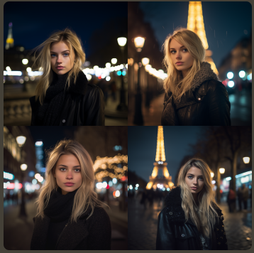

  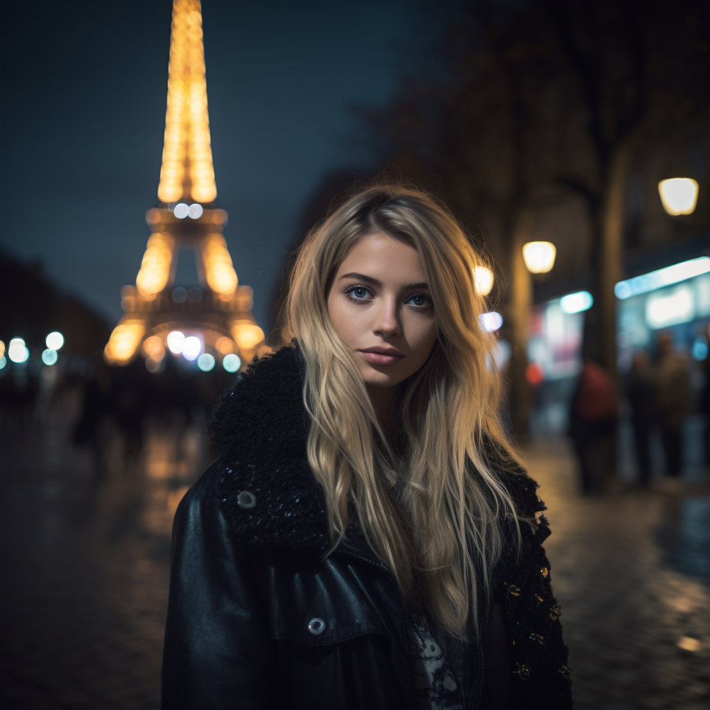

  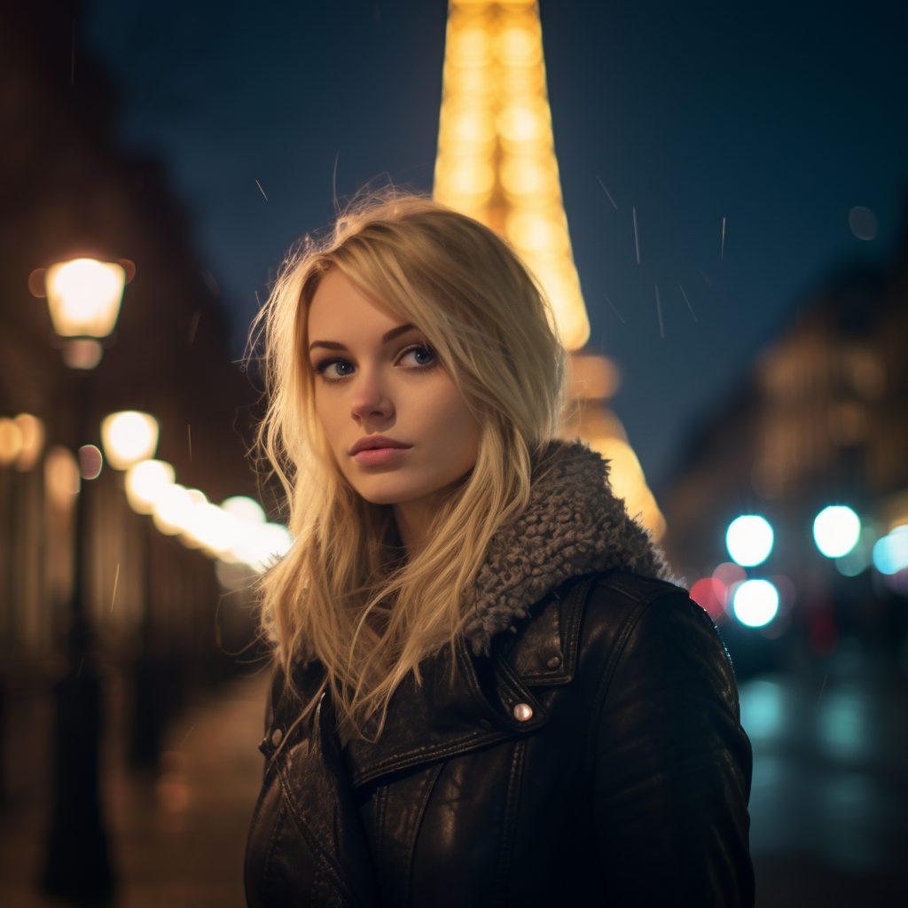

- 宝丽来相机：Polaroid，是著名的快速成像品牌，可以拍摄带有怀旧、复古效果的照片，深受摄影爱好者的喜爱。

  ```
  micky cat posing for a picture at Disney World, Polariod
  ```

  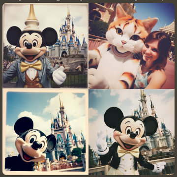

  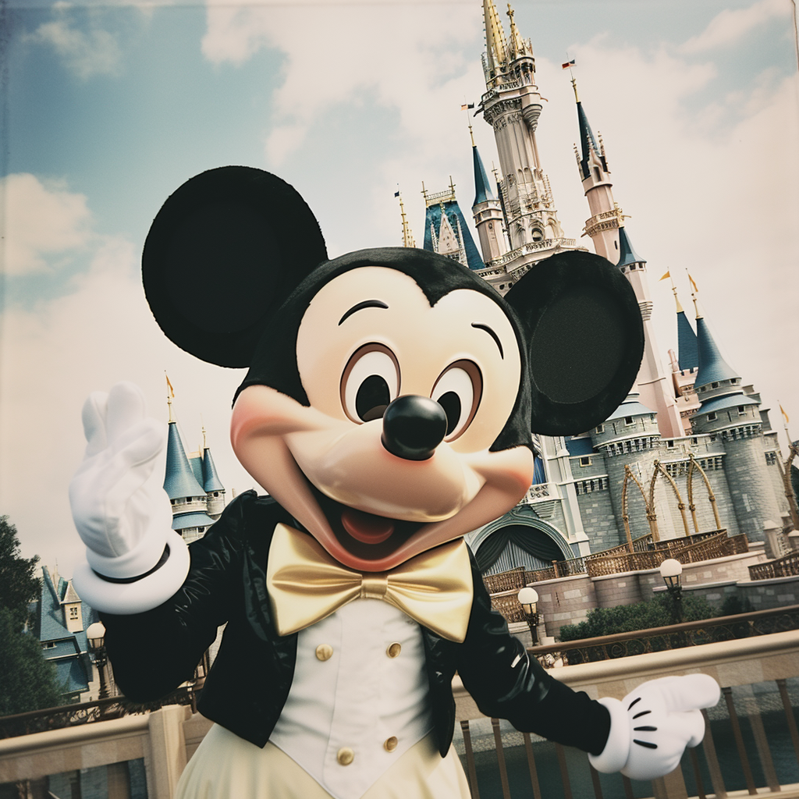

- Insta 360：是一款热卖的全景运动相机，用于拍摄全景照片。

  ```
  colosseum, Insta 360 --ar 2:1
  ```

  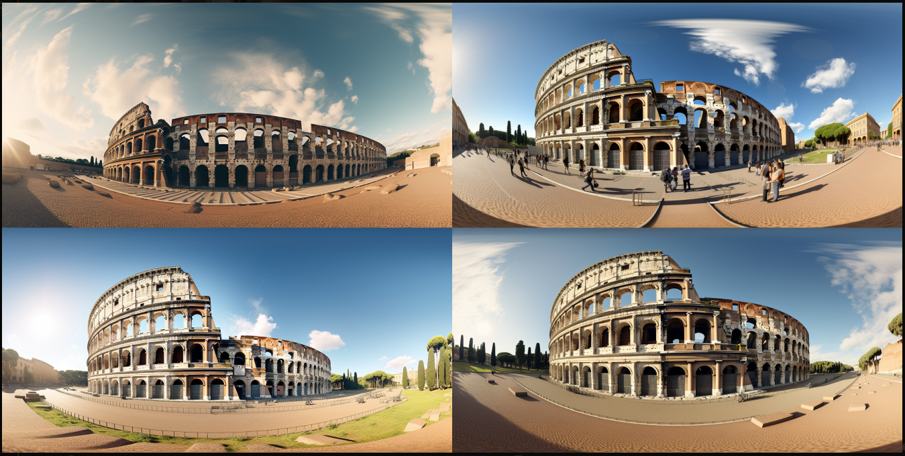

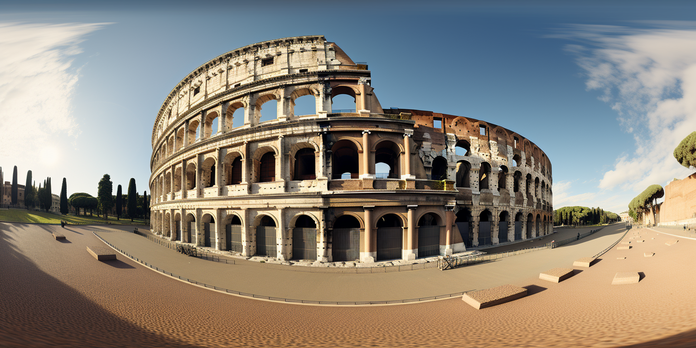

- 胶卷型号：在命令中添加特定的胶片型号也能获得不错的效果，例如，经典的富士胶片适合拍摄风景照。

  ```
  Hong Kong night view, Fuji color film --ar 3:2
  ```

  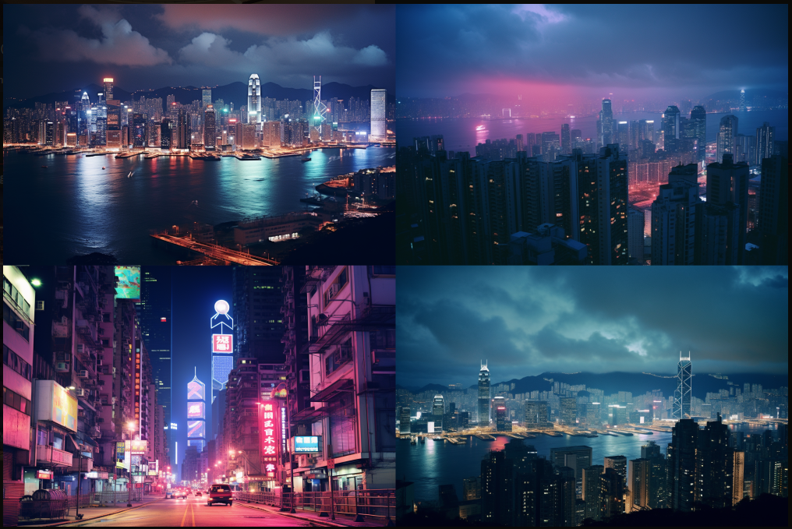


## 灯光和照明


- Cinematic lighting

  ```
  cinematic lighting, ultra detailed --ar 2:1
  ```

  

- accent lighting：提示机器人加强灯光和照明，让处于暗处的人物获得充分曝光。Global illumination：意味着全局照明

  ```
  girl in the deep forest, 35mm lens, f/1.8, cinematic, clean face, features, accent lighting, global illumination, photorealistic --uplight
  ```


## 镜头和光圈


- 35mm lens f/1.8：生成人像的时候，即 35mm 焦距镜头、f/1.8 光圈，这一组合非常适合人像拍摄，是很多摄影师的首选。

  ```
  girl in the deep forest, 35mm lens, f/1.8, cinematic, clean face, features, accent lighting, global illumination, photorealistic --uplight
  ```

  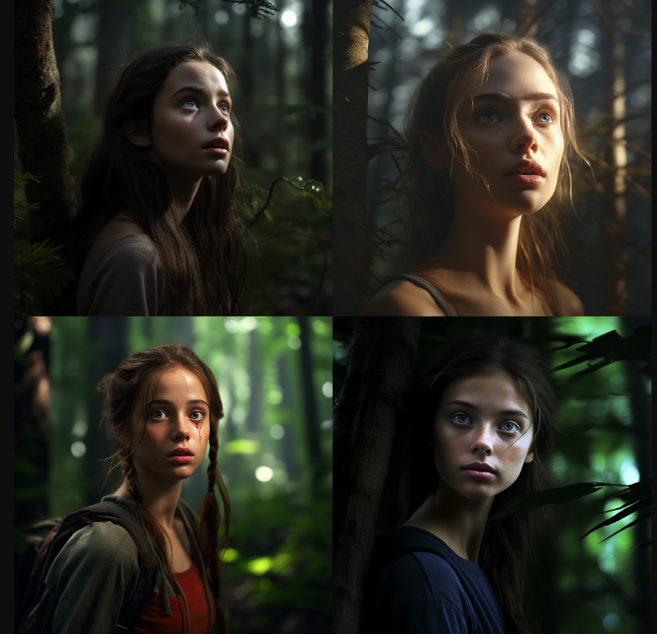

- 85mm lens f/4：则可以带来梦幻的背景虚化效果

  ```
  a photo of a beautiful girl, in Paris night, neon light, shot on a sony mirrorless camera, DSLR, 85mm lens f/4, ultra detailed, full body, 8K
  ```

  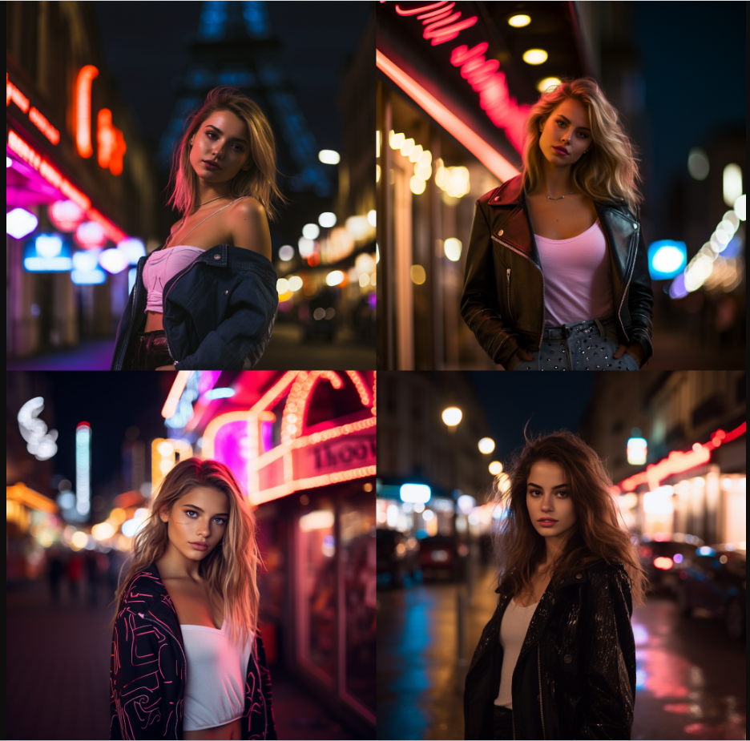

- 50mm lens f/2.8：则适合微距拍摄，如拍摄人物、物体

  ```
  a photo of a female model in Miami beach, sunset, shot on sony mirrorless camera, DSLR, 50mm lens f/2.8, ultra detailed, 8K --ar 2:3
  ```

  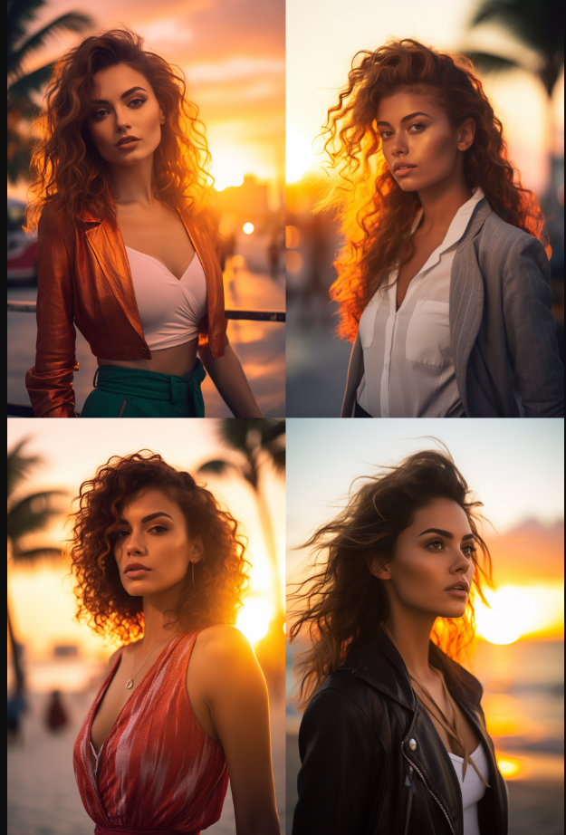


## 摄影风格


- 国家地理：National Geographic，经常刊登令人震撼的摄影作品，主体以自然、人文、动物为主。

  ```
  National Geographic style, emperor penguin swims in deep sea --ar 3:2
  ```

  


## 快门动作


- 动态模糊：motion blur，可以给快速移动的物体添加明显的动态模糊效果

  ```
  a close up shot of a cheetah running fast, motion blur, sunny day, UHD
  ```

  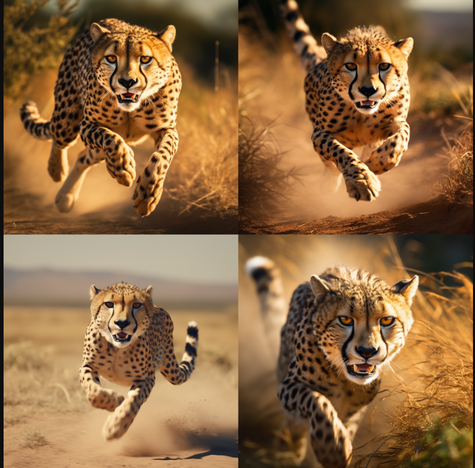

- 快门抓拍：fast shutter speed，可以生成高质量图像，模拟抓拍的精彩瞬间。

  ```
  photorealistic shot of a blue whale jumps out of the ocean, fst shutter speed, 1/1000 sec shutter, extreme long shot, taken from a ship, sunny day
  ```

  

  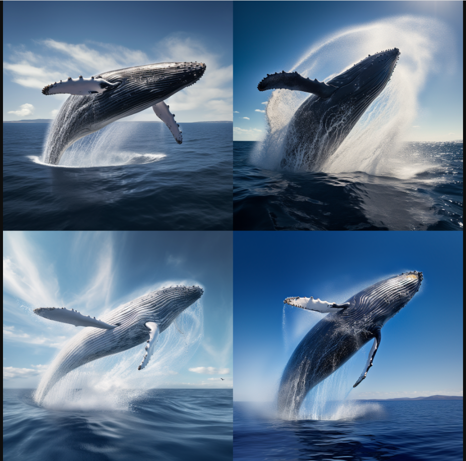


再简单介绍一些常用的摄影命令，用于生成真实的图像。

- 超清面部特征：clean facial features
- 超清细节描述：ultra detailed
- 照片级真实：photorealistic
- 一般指三维动画：CGI
- 霓虹灯效果：neon
- 真实人像摄影：real life portrait photography
- 超现实主义：Hyper Realistic
- 获奖人像摄影：award winning portrait photography
- 抓拍效果：fast shutter speed shot
- 动态模糊效果：motion blur


