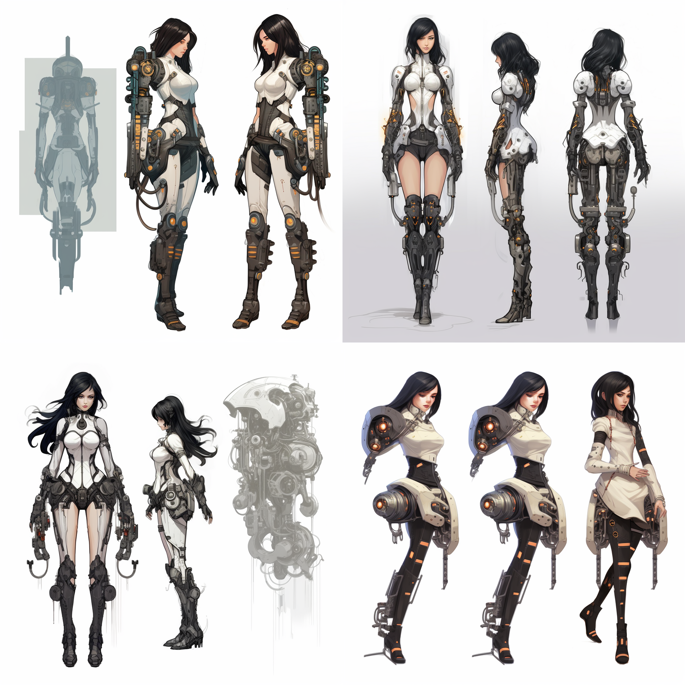
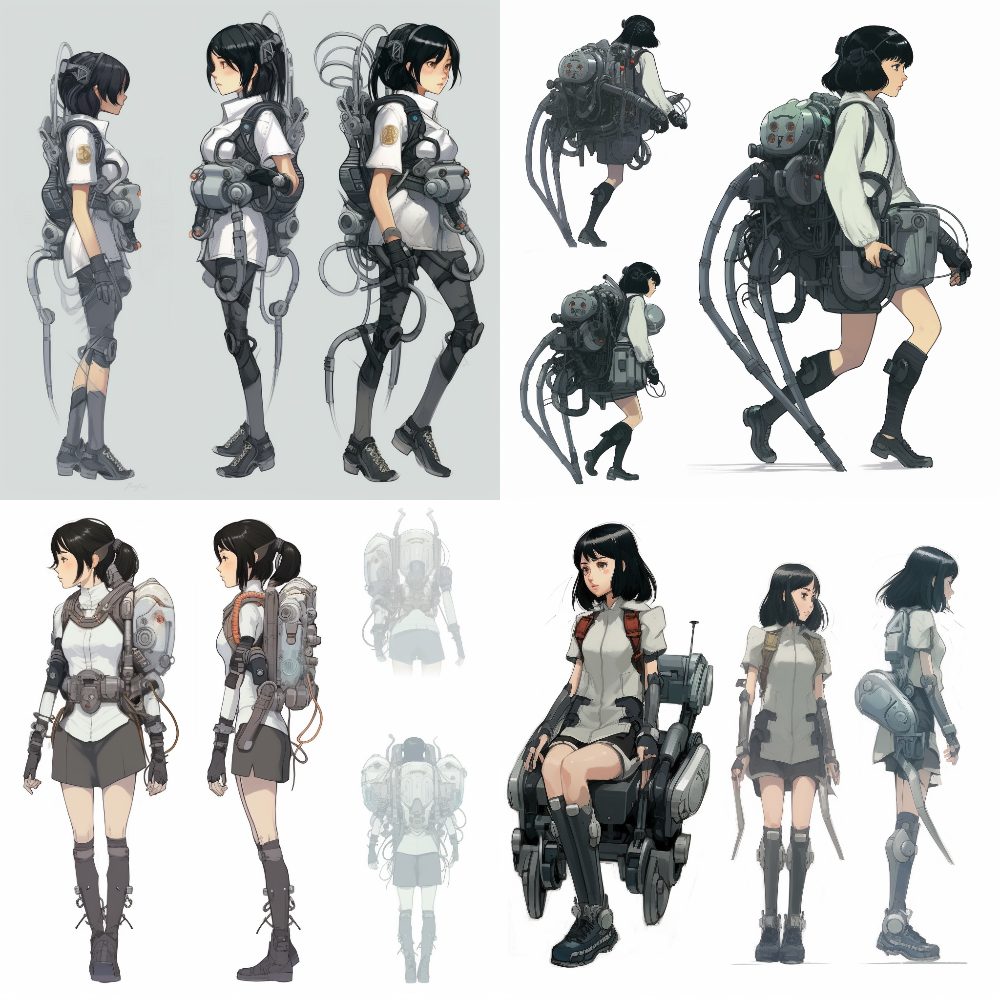

# 05. 游戏原画


## 角色设计


重要的关键词 + 人物角色描述 + 风格关键词


重要的关键词举例如下，

- 角色设计：character design
- 多重概念设计：multiple concept design
- 概念设计表：concept design sheet
- 特写角色设计：close-up character design


人物角色描述举例如下，

- 机器人：Robot
- 詹姆斯/邦德：James Bond
- 黑发：black hair
- 女性：Femal


示例，

```
conceptual design table, a black-haired female mechanical exoskeleton, white background, Yoji Shinkawa style
```


```
multiple concept design, a black-haired mechanical exoskeleton girl, white background, Yoji Shinkawa style, manuscript, three views
```


## 风格设计


我们还可以使用 AI 绘画工具调整画面风格，如写实、卡通、油画、水彩等，并通过调整画面的色调、明暗、线条来使其更加符合游戏的整体氛围和情感倾向。


- 浮世绘风格

  ```
  multiple concept design, a black-haired mechanical exoskeleton girl, white background, Japanese Ukiyo-e, manuscript, three views
  ```

  

- 蒸汽朋克风格

  ```
  multiple concept design, a black-haired mechanical exoskeleton girl, white background, Steampunk, manuscript, three views
  ```

  

- 英雄联盟风格

  ```
  multiple concept design, a black-haired mechanical exoskeleton girl, white background, League of Legends on white background, manuscript, three views
  ```

  


## 特效表现


确定人物设计和风格设计之后，可以使用 Seed 在保持原设计稿不变的情况下生成游戏中的特效元素，如魔法、爆炸、烟雾等，并通过调整特效元素的形态、颜色、透明度等，使其更加真实。


- 带火焰特效的光轮天使

  ```
  a female angel sits on a light wheel, close-up character design, multiple concept design, concept design table, white background, Yoshitaka Amano style
  ```

  

- 带火焰特效的光轮天使

  ```
  an angel sits on a light wheel with magic flames, close-up character design, multiple concept design, concept design table, Yoshitaka Amano style
  ```

  

## 背景和场景设计


使用 AI 绘画工具，不仅能在原角色设计图中添加特效，还能在原角色设计图的基础上生成背景和场景，如城市、森林、草地、水域等，并通过调整色彩、光影、材质等，使其更加逼真和引人入胜。初次之外，还可以添加动作关键词，赋予角色和物体动态感，如角色的行走、攻击、受伤等。

以宫崎骏风格的机械臂少女角色设计图为例，想要更改场景的话，可以使用 Seed 模式，添加一些描述词。


```
multiple concept design, black-haired mechanical exoskeleton girl, white background, Studio Ghibli, manuscript, three views --seed 29422033207
```



```
multiple concept design, black-haired mechanical exoskeleton girl, Studio Ghibli, manuscript, three views, the character remains the same, and the background changes to a forest, walking in the magic forest --seed 29422033207
```

  

## 剧情设计和角色互动


在游戏原画中，可以通过生成角色之间的情感互动和剧情元素来强化角色的情感深度和吸引力，也可以通过生成角色的表情、姿态和动作，强化人物特征，使其更加生动。读者可以自行添加相关关键词，体会生成效果。

